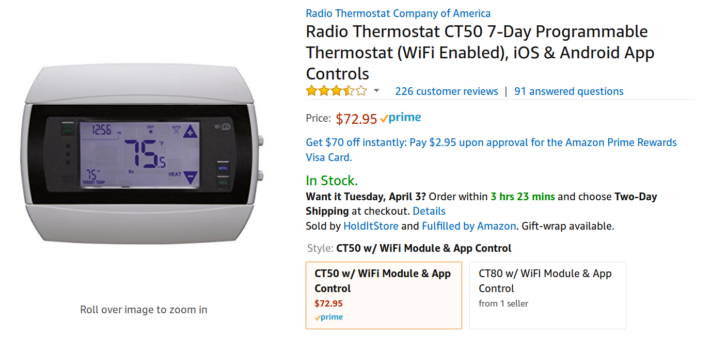

# Radio Thermostat REST API



The Radio Thermostat CT50 & CT80 (perhaps other models too) support a documented REST API to control heating/cooling in your house from your LAN. This is particularly interesting because there doesn't seem to be any authentication to access this API, leaving anyone on the network to have full control of the device. Daniel Crowly of Trustwave SpiderLabs [reported this vulnerability](https://web.archive.org/web/20180401193243/https://www.trustwave.com/Resources/Security-Advisories/Advisories/TWSL2013-022/?fid=3870) back in 2013, but the company doesn't seem to give a sh!t.

> CVE: CVE-2013-4860
> CWE: CWE-287 Improper Authentication

>When on the same network as a Radio Thermostat unit, no authentication is
required to use any part of the API. Users on the same subnet as the unit
can query and change various settings such as the operation mode, wifi
connection settings, and temperature thresholds.

Worse yet, there is no [Host or Referer \[sic\] header validation](https://github.com/brannondorsey/host-validation), which can expose the device to the WAN via a [DNS Rebinding attack](https://en.wikipedia.org/wiki/DNS_rebinding) (using [`whonow`](https://github.com/brannondorsey/whonow) or another malicious DNS server). I've done this successfully myself by sending someone on another network a link that, once followed, will set the target temperature in their house to 95 degrees.

Here I've provided a few notes on how the API works. If you have one of these devices you can control it via CURL using the code below. Any HTTP client should work too, as I've controlled the device via JavaScript's `fetch` API in the browser too. This isn't an exhaustive list of API endpoints and functionality, but its a quick overview of some of the most interesting stuff. For more info, see the official API documentation PDF below.


[Official Radio Thermostsat API Documentation PDF](RTCOAWiFiAPIV1_3.pdf)

If you do have one of these suckers, you should play with it, but then I'd recommend disabling WiFi or disconnecting it from your home network as it is trivial for attackers to control the temperature in your house so long as you are browsing the web on the same network.

There is also a [Python API](https://github.com/mhrivnak/radiotherm) for communicating with the device, however I have not used it myself. I've confirmed that this API works with a CT50 I purchased on Amazon in March 2018 (version V1.94, firmware v1.04.84, and API version 113).

```bash
#!/bin/bash

THERMOSTAT="192.168.1.100"

# general stats
curl "${THERMOSTAT}/tstat" -X GET

# get the thermosat model
curl "${THERMOSTAT}/tstat/model" -X GET

# version
curl "${THERMOSTAT}/tstat/version" -X GET

# current temperature
curl "${THERMOSTAT}/tstat/temp" -X GET

# thermostat operating mode
# tmode: 0 = OFF, 1 = HEAT, 2 = COOL, 3 = AUTO
curl "${THERMOSTAT}/tstat/tmode" -X GET
curl "${THERMOSTAT}/tstat" -d '{"tmode": 0}' -X POST # OFF
curl "${THERMOSTAT}/tstat" -d '{"tmode": 1}' -X POST # HEAT
curl "${THERMOSTAT}/tstat" -d '{"tmode": 2}' -X POST # COOL
curl "${THERMOSTAT}/tstat" -d '{"tmode": 3}' -X POST # AUTO

# fan mode
# fmode: 0 = AUTO, 1 = AUTO/CIRCULATE, 2 = ON
curl "${THERMOSTAT}/tstat/fmode" -X GET
curl "${THERMOSTAT}/tsta" -d '{"fmode": 0}' -X POST # AUTO
curl "${THERMOSTAT}/tsta" -d '{"fmode": 1}' -X POST # AUTO/CIRCULATE
curl "${THERMOSTAT}/tsta" -d '{"fmode": 2}' -X POST # ON

# check if the target temperature has a temporary override
# override: 0 = DISABLED, 1 = ENABLED
curl "${THERMOSTAT}/tstat/override" -X GET

# target temperature hold status
# hold: 0 = DISABLED, 1 = ENABLED
curl "${THERMOSTAT}/tstat/hold" -X GET
curl "${THERMOSTAT}/tstat" -d '{"hold": 1}' -X POST

# set absolute heat (have to set mode and heat)
curl "${THERMOSTAT}/tstat" -d '{"tmode": 1, "a_heat": 95}' -X POST

# set absolute cool (have to set mode and cool)
curl "${THERMOSTAT}/tstat" -d '{"tmode": 2, "a_cool": 35}' -X POST

# set the temporary target heat AND mode (heat mode)
# t_heat: accepts values between 35-95
curl "${THERMOSTAT}/tstat" -d '{"t_heat": 95}' -X POST

# set the temporary target heat AND mode (cool mode)
# t_heat: accepts values between 35-95
curl "${THERMOSTAT}/tstat" -d '{"t_cool": 35}' -X POST

# LED
curl "${THERMOSTAT}/tstat/led" -d '{"energy_led": 0}' -X POST # OFF
curl "${THERMOSTAT}/tstat/led" -d '{"energy_led": 1}' -X POST # GREEN
curl "${THERMOSTAT}/tstat/led" -d '{"energy_led": 2}' -X POST # YELLO
curl "${THERMOSTAT}/tstat/led" -d '{"energy_led": 4}' -X POST # RED

# Messaging/Text
# user messaging area (only available on CT80)
# uma: line = 0, 1 message = string
curl "${THERMOSTAT}/tstat/uma" -d '{"line": 0, "message": "pwnd by braxxox"}' -X POST
# price messaging area, can only write numbers (like, BOOBS)
# uma: line = 0, 1, 2, 3 (corresponding to energy unit kW, etc) message = numbers
curl "${THERMOSTAT}/tstat/pma" -d '{"line": 1, "message": "80085"}' -X POST

# Night Light
curl "${THERMOSTAT}/tstat/night_light" -X GET

# CT80 only I believe
curl "${THERMOSTAT}/tstat/night_light" -d '{"intensity": 0}' -X POST # OFF
curl "${THERMOSTAT}/tstat/night_light" -d '{"intensity": 1}' -X POST # 25%
curl "${THERMOSTAT}/tstat/night_light" -d '{"intensity": 2}' -X POST # 50%
curl "${THERMOSTAT}/tstat/night_light" -d '{"intensity": 3}' -X POST # 75%
curl "${THERMOSTAT}/tstat/night_light" -d '{"intensity": 4}' -X POST # 100%

# it looks like this might provide an auth key!
curl "${THERMOSTAT}/cloud" -X GET

# get system information
curl "${THERMOSTAT}/sys" -X GET

# get the system name
curl "${THERMOSTAT}/sys/name" -X GET
curl "${THERMOSTAT}/sys/name" -d '{"name": "hack the planet!"}' -X POST

# get WiFi network information
curl "${THERMOSTAT}/sys/network" -X GET

# get supported modes and API endpoints on the system
# httpd_handlers is contains key value pairs like "path" : [SUPPORTS_GET, SUPPORTS_POST]
# "httpd_handlers":{
#     "/tstat":[1,1],
#     “/cloud”: [1,1],
#     "/sys/network":[1,1],
#     “/sys/updater":[0,1],
#     "/sys/filesystem":[0,1],
#     "/sys/firmware":[0,1],
#     "/sys/fs-image":[0,1],
#     "/sys/fw-image":[0,1],
#     "/sys/command":[0,1],
#     "/sys/services":[1,0],
#     "/sys/mode":[1,1],
#     "/sys/name":[1,1],
#     “/sys/reboot”:[1,1],
# }
curl "${THERMOSTAT}/sys/system" -X GET

# get live diagnostic stats
curl "${THERMOSTAT}/sys/diag/stats/live" -X GET

# get live diagnostic history
curl "${THERMOSTAT}/sys/diag/stats/history" -X GET

# reboot the device
curl "${THERMOSTAT}/sys/command" -d '{"command": "reboot"}' -X POST
```
